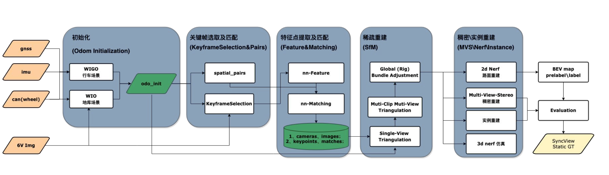

# Static scene reconstrcution

## Framwork
通过Structure From Motion 实现高精准的pose重建；
- 通过3D重建实现点云级别或者object级别的重建，通过人工标注积累原始数据，训练大模型进行预刷
  稠密点云的成本比较高，计算量大
- 通过对不同种类的物体直接进行重建，避免点云重建，如路面、灯牌锥等 （只对目标物/路面进行重建）

### 使用多传感器融合的初始化（gnss & imu & wheel），利用pose-graph的方案
gnss 提供位置，imu 进行预积分，wheel 提供速度信息，做pose-graph的优化框架，初始化的主要目的是提供一些高精度的pose,利用初始的pose在后边进行三角化, 另外就是利用gnss引导关键帧的匹配，因为pose里有全局pose 

以重投影误差为观测指标，同时优化3d点的位置和相机pose, 即BA优化，进行单视图的BA之后得到Singlue view 的轨迹，这个轨迹和初始化的轨迹不同之处在于做了视觉的约束。
在这个基础之上利用外参对其他视角进行三角化， 进行全局BA，和前边的BA 不同之处有外参约束。

基于稀疏的重建可以进行稠密的重建

- 基于重定位方案，实现标注复用（降本）、雨天等极端场景真值获取（增效），真正能实现自动标注的方案
先进行单个clip的重建，重建完之后利用图像之间的特征匹配到特征库中已有的特征然后进行BA。精度和重建的精度差不多。 

