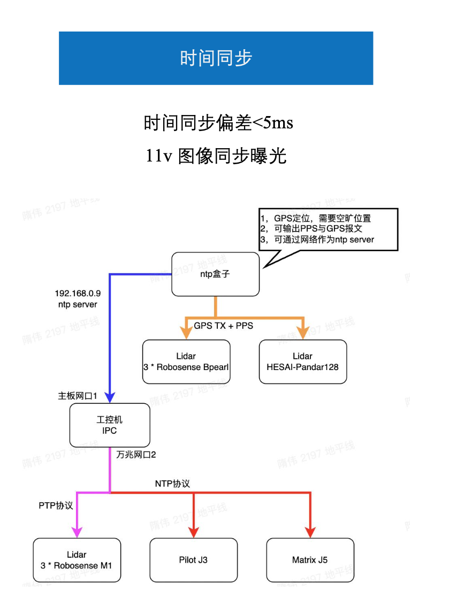
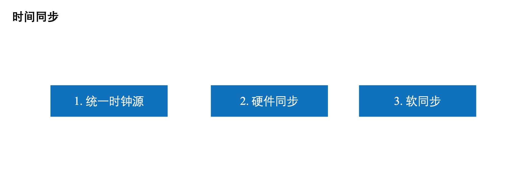
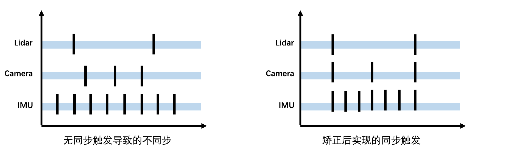
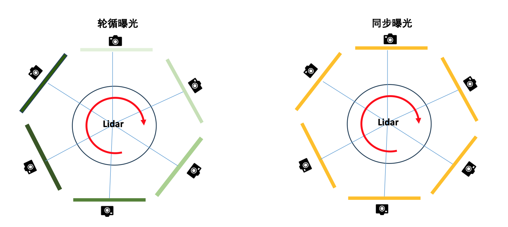
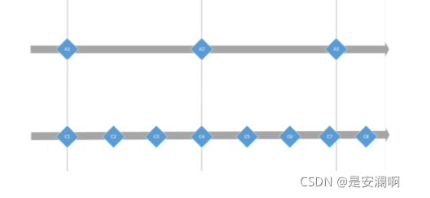

# Time sync

## 时间同步

### 统一时钟源
- 智能驾驶是一个时间敏感的测量系统只有各个SoC在一个精确的时间体系下，驾驶系统才能够正常运作

| 方式     | 优势                                                         | 缺点                                                         |
| -------- | ------------------------------------------------------------ | ------------------------------------------------------------ |
| PPS+NMEA | 协议简单，容易实现                                           | 必须基于RS232，RS232是一种1对1的全双工通信形式，也可以通过主从形式 实现1对几数据传输。但多个设备之间实现同步比较困难 •PPS是无屏蔽的单线脉冲信号，十几根PPS线穿梭在车内，极易受到车内恶劣 电磁环境的干扰 •当时钟源丢失的时候，所有需要时间同步的设备都一下子没有了主心骨 |
| PTP      | 提供了准确的时间戳记 •具备更低的建设和维护成本，并且由 于可以摆脱对GPS的依赖，在国家安 全方面也具备特殊的意义。 •相比NTP(Network Time Protocol， 网络时间协议)，PTP能够满足更高 精度的时间同步要求 | 如果主时钟发生故障，整个通信系统将停止 •想要获得理想的精度需要专业的PTP授时服务器，同时服务器能接收卫星信号， 会提高使用成本。 •依赖授时服务器本地晶振来保持系统时间的稳定，晶振的不同会影响授时精度 •要能实现高精度时钟同步系统的运行，网络设备和客户端设备都需要支持 IEEE1588协议，可能会增加整体系统的成本。 |

### 硬件同步

 - 硬件同步主要用来解决不同传感器之间的频率差异导致的时间戳不同步的问题

   

- Lidar 和camera 的硬同步触发方式

  - 轮循曝光是当Lidar 扫描到相机中心的时候，相机曝光，不同相机依次曝光
  - 另一种方式是多个相机同时曝光

  

### 软同步

 - 软同步弥补各个传感器的频率在几个周期内无法重叠的问题

| 时间插值方式       | **插值方式介绍**                                             | **优劣势**                                                   |
| ------------------ | ------------------------------------------------------------ | ------------------------------------------------------------ |
| 时间直接配准法     | 直接配准法，适合帧率具有整数倍数关系的传感器之间， 以频率 低的为基准，找出时间戳对应的数据即可 | 这种方法误差比较大，而且要求传感器 之间的帧率是整数倍。      |
| 时间最小二乘拟合法 | 将其中一个传感器的观测数据通过某种特定的拟合原则得到一个关 于时间的曲线，然后通过该 曲线得到与另一个传感器对应时刻的 数值，即可得到同一时刻两种传感器的数据配准 |                                                              |
| 内插外推法         | 利用两个传感器帧上的时间标签，计算出时间差，然后通过包含有 运动信息的目标帧与时间差结合，对帧中每一个目标的位置进行推 算，推算出新的帧时各个目标的位置，并于原有的两帧之间建立新 的帧。 | 内插外推法适用于传感器间帧率不存在 倍数关系的情况，或者传感器有帧率不 稳定的情况 |

### Nuscenes dataset sensor synchronization
To achieve good cross-modality data alignment between the lidar and the cameras, the exposure of a camera is triggered when the top lidar sweeps across the center of the camera’s FOV. The timestamp of the image is the exposure trigger time; and the timestamp of the lidar scan is the time when the full rotation of the current lidar frame is achieved. Given that the camera’s exposure time is nearly instantaneous, this method generally yields good data alignment5. We perform motion compensation using the localization algorithm described below.

lidar 扫描到摄像头fov的中心时出发摄像头曝光，图像的时间戳是曝光触发时刻的时间，lidar的时间戳是当前lidar frame 完成旋转的时间戳，考虑到摄像头的曝光时间几乎是瞬时完成的,这种方法通常产生好的数据对齐。使用以下定位算法进行运动补偿。

#### 其他数据集的传感器对齐方式

#### 同步方式涉及到激光雷达3D标注时的运动补偿

3d 目标检测的真值一般还是通过激光雷达进行标注，但是激光雷达只能标注静态的目标，运动的目标需要进行跟踪物体，得到物体的motion state,
激光雷达进行运动补偿，补偿的是ego-motion，t-1 时刻的ego-pose和 t timestamp 的ego-pose, 就可以算出静态物体的点云。

自动驾驶车辆在行驶中可能遇到各种运动干扰，研究引入了3种运动级别的干扰：运动补偿、移动物体和运动模糊。车辆自身运动导致点云失真，通常使用运动补偿来纠正，但这可能引入噪声，称为运动补偿干扰。移动物体表示场景中某个物体在快速移动，可能导致其3D包围框内的点发生偏移。最后一种干扰是摄像头图像的运动模糊，是由于驾驶速度过快引起的。

