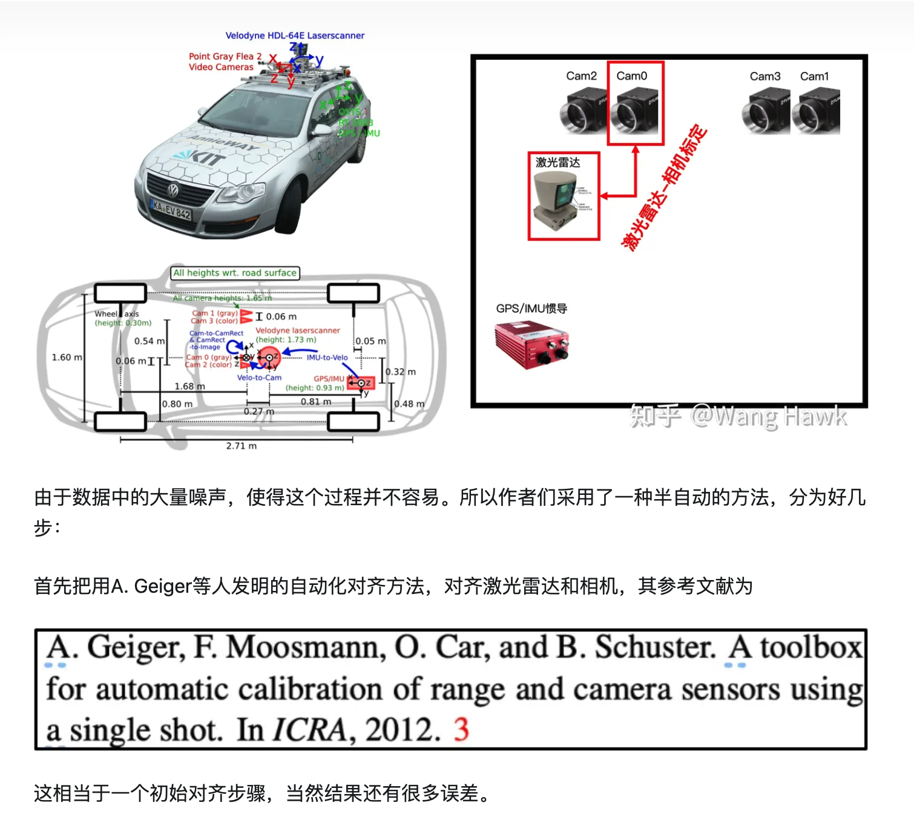
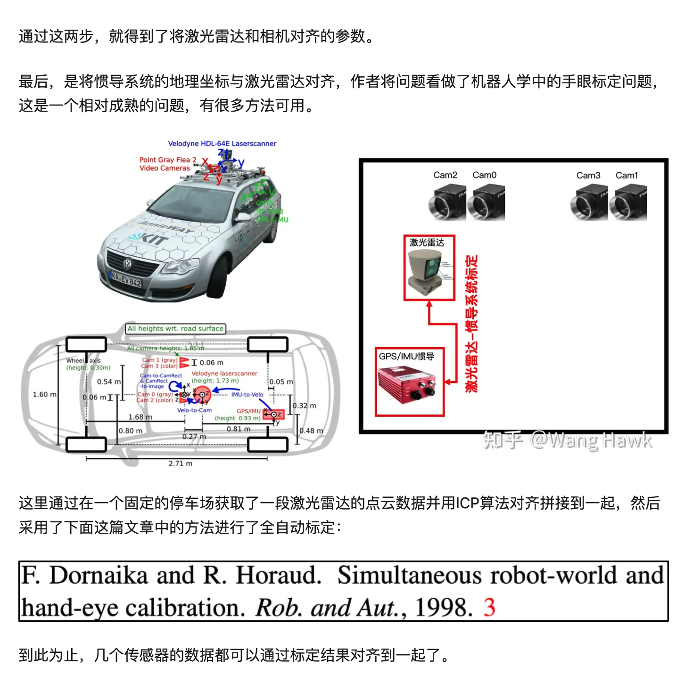
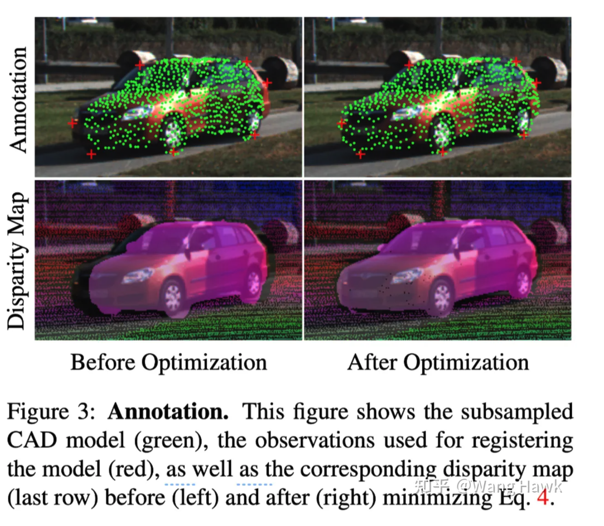

# 双目感知的意义
## 意义

既然特斯拉、百度/极越已经在一定规模下证明了纯视觉 L2+ (highway/city, FSD) 的可行性，
那为什么还要去研究双目呢？双目、LiDAR 相较于 2M 的 30/60/120 和 8M 的 30/120 的区别是什么？我的看法是：

- 在线：在数据规模有限的情况下，双目和 LiDAR 一样，能快速提升感知性能上限；
- 离线：可用于 auto-label 中的预标注、建图；
- 成本：相较于 LiDAR，在成本上有显著优势；
- 标定：前向标定在流程上也会更简单；
- 架构：双目硬同步 (vision-centeric)，来触发、对齐其他相机，相较于 LiDAR-centeric 更精准。
但是很可惜，基于 DL-Stereo 的方法需要稠密的深度 GT，而现在的 LiDAR 往往只能提供 150m 内的 GT. Livox Tele 的 FoV 较小，
**超远处的反射率和点数不足以支撑我们的需求和场景。最终在远距离使用的，还是基于传统特征的稠密/稀疏匹配。**

## 鉴智

也有做 MVS 和全向深度估计 Full Surround Monodepth from Multiple Cameras (TRI-ML/VIDAR)

## 维宁尔 (Veoneer)

## 智加

第一件事是，通过 SGM/optical flow 这些底层特征，识别非标/超宽障碍物。但实践下来，很难简单地与 3D 表达兼容。
我们渐渐地发现，相较于2D 视角，BEV/Occupancy
是一个更优雅的框架去解决这些难题。逻辑上还是相似的，BEV/Occ 仍然需要去表达、解释这些稠密的底层特征和时序特征。

通过稠密深度图去避让超宽车

通过光流 motion seg 去识别障碍物

第二件事是，仅对 bbox 内的点去做 match，相同精度下仅有 1/2 latency，并能提升远处 recall. 即使在夜晚，我们也能有 300m 的稳定 trakcing.

第三件事是，在高分辨图下，动态裁剪 2M 原图，通过一个额外的 2D 检测器以及稀疏匹配，实现远距离小目标 2倍 tracking 性能的提升 (cone, 80m->160m), 
整体感知 tracking 距离从 300m+ 到近 400m.

第四件事是，实现长焦双目。效果显而易见, Z=fb/d. 焦距 f 的提升能够简单而有效地提升远处距离性能。但简单替换相机，
会造成前向盲区过大的问题。在框架上，需要通过广角相机去做车道线等模块。有一定的系统迁移成本。

上面这些工作，都是在 Xavier 低算力平台下循序渐进的思考和实践。在 Orin 平台下，我们已经渐渐地过渡到视觉 BEV 3D 框架。
但正如图森的分享，在卡车领域里，数以亿计的 2D 数据仍然在和 3D 需求互相融合，继续完善。
后续的实践，是将高分辨率 RoI 双目集成到 BEV 框架中。当有充沛的远距离 GT 数据时，不管是 dense-bev 还是 
sparse query bev，都能看得更远更稳。

稠密的远距离深度难以获取，但稀疏的bbox 标注仍然是可以得到的。所以，DL 下的双目，
可能直接做双目3D检测或者BEV下的3D检测更简单些。

reference:
https://zhuanlan.zhihu.com/p/681075174

## 传统的稠密/稀疏的匹配方法有哪些？
### SGM
### GM

### stereo 数据集制作
[KITTI 立体匹配数据集](https://zhuanlan.zhihu.com/p/521777576)
用高灵敏度的灰度摄像头来进行立体匹配和光流这样的任务
##### sensor calibration
- 相机内外参数标定
  首先是相机的内外参数标定，作者们在墙上贴上 棋盘格，然后通过最优化重投影误差的方式进行了相机标定，接下来用标定的参数对图像做了立体校正 
- lidar 和camera 之间的标定
- 
- 这相当于一个初始对齐步骤，当然结果还有很多误差。接下来，人工在激光雷达点云和图像中标注一些明显的物体边缘曲线，**同时也利用选定的表现最佳的立体匹配算法计算视差图**。现在要做的是迭代式的优化激光雷达和相机之间的几何参数，使得点云匹配点的重投影误差，以及立体匹配过程中的错误点的数量都达到最小——这是一个联合迭代式优化的过程。
- 通过这两步，就得到了将激光雷达和相机对齐的参数。最后，是将惯导系统的地理坐标与激光雷达对齐，作者将问题看做了机器人学中的手眼标定问题，这是一个相对成熟的问题，有很多方法可用。
- 这里通过在一个固定的停车场获取了一段激光雷达的点云数据并用ICP算法对齐拼接到一起，然后采用了下面这篇文章中的方法进行了全自动标定：

###### ground truth 数据生成
作者生成了多种类型的Ground Truth数据，我们这里主要关注的是立体匹配研究用的标准视差数据。在某个感兴趣的图像帧，作者采集了前5帧和后5帧的点云数据，并把这些点云数据通过ICP算法对齐到一起，并投影到感兴趣的图像帧上——你可以理解目标就是得到图像的每个像素的3D坐标，这些信息自然可以通过标定数据转换为视差图。作者删除了容易出错的窗户、围栏等目标。同时，由于激光雷达的特性，被遮挡的物体的3D坐标及视差值是无法稳定的恢复的，所以作者没有对结果做插值填补信息，所以实际生成的视差图中平均约包含50%的像素包含理想的视差值。

##### KITTI 2015 生成了绸密的运动场景估计
- 第一步是获取场景的静态物体的点云。这里首先需要同时利用GPU/IMU惯导系统和激光雷达系统来联合优化，得到了多个帧高精度对齐后的点云信息，其中只包括了静态目标。而运动目标的信息则被移除掉，留待下一步填补。
- 第二步则是处理动态物体。由于动态物体的3D点云无法仅通过激光雷达得到，所以作者采用了用AutoCAD制作的标准3D模型抽样映射的方式，来恢复动态物体的3D点云。这就涉及到需要把原始点云与AutoCAD 3D模型相匹配的过程——这本来要求场景中每个车都有对应的3D模型，这显然是不可能的。所以作者采用的是用最接近场景目标的3D模型来代替的方案（这里选用了16种3D车模），可以看下面的示意图。其中左列里面，绿色点是CAD的模型点（每种模型抽取了约3000个点），红色十字架是手工标注的需要和CAD模型对齐的点。通过类似ICP算法，可以把CAD模型和上述红色十字点对齐到一起，这样点云就变成了右列的样子，对应的视差图（右下）也就相应得到了优化。

这个过程中还有一些细节，但由于篇幅原因
[Object scene flow for autonomous vehicles]()
由于KITTI2015的数据中一些关于动态物体的信息是用上述方法合成的，因此用于评价立体匹配算法的优劣时可能会出现偏差，因此在KITTI2012的静态场景表现好的方法到了KITTI2015中可能表现不够好。而如果在KITTI2015中表现好的算法，则和理想的结果很可能有差距。

##### KITTI 360 

