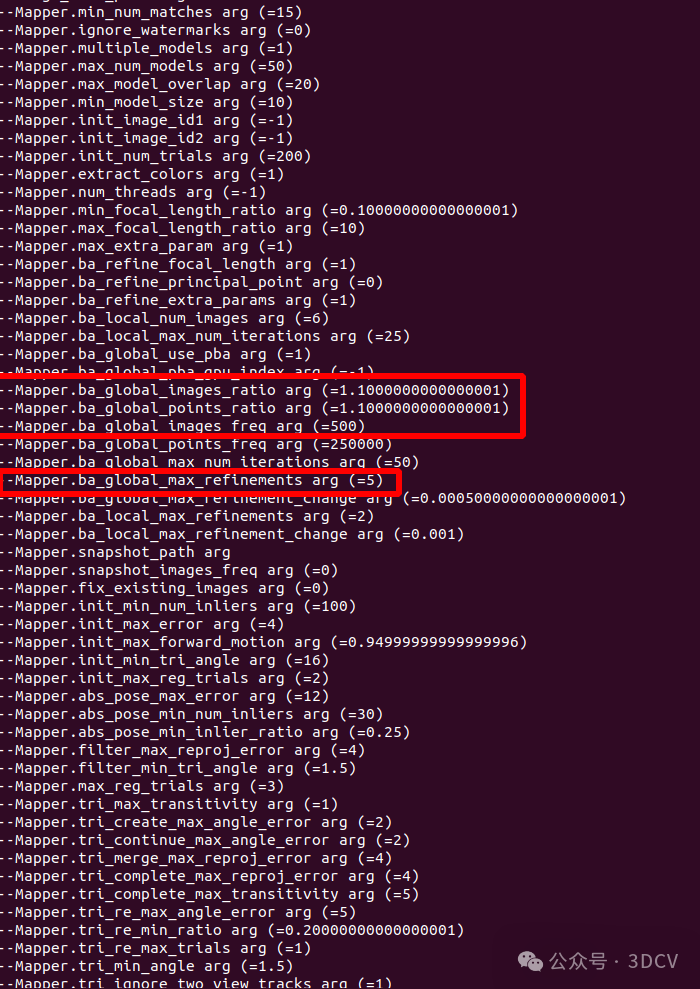
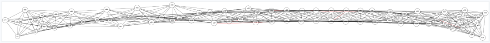

[code](https://colmap.github.io/install.html)

#### 存在的问题与未来
不管是、colmap(sfm)是用来作为nerf/gaussian splating从业从人员的输入源，还是作为AR众包地图的构建，还是用来4D时空标注的辅助，在使用的时候难免会处理大场景数据而不是简单的跑一个小数据来作为demo展示。通常这个时候很多问题就随即出现，人们就开始抱怨：为什么colmap如此慢？它的bottlenecks是什么？为什么会出现drift？为什么车载数据就跑了两帧程序就终止？为什么...?等等让人哭笑不得的问题。如果你不是一个三维死忠爱好者或者只是想要把数据快速处理完毕，那么针对以上的抱怨解决方法不需要你去深究colmap的源码，痛苦的去improved,只需要调参也可以达到你的目的。

对于调参人员来说：
（1）为什么colmap如此慢?
如果你的数据是车载数据即forward motion，那么其实local ba足够，不需要太频繁的global ba(众所周知ba的复杂度是(camera_params+6N+3n)^3，因为每次新加入的图像主要和其周围的地图有关系。所以调整mapper以下参数即可：


i.减少ba_global_max_refinements次数 (5改为1）
ii.增大模型增大到一定比例触发global ba的参数
```
Mapper.ba_global_images_ratio 、 Mapper.ba_global_points_ratio 、Mapper.ba_global_images_freq
```

2）为什么车载数据就跑了两帧程序就终止？如果你的数据质量不佳或者是车载数据是比较困难处理的，因为baseline短且图像两边的特征消失的很快，这个时候采用默认参数去跑，通常会出现初始化完后就终止了程序，这个时候就要调小初始最小三角化角度Mapper.init_min_tri_angle（默认16调成5）。
对于研究源码的人员来说，colmap的improved方面数不胜数，离一个可用的状态需要做很多的工作：
（1）关于相机模型的选择，在处理数据的时候，如果相机模型选择简单的，会造成欠拟合，出现blend map之类的现象，如果选择复杂的相机模型就会出现不收敛的情况。
（2）关于匹配方面，colmap中匹配有词汇树匹配方法，但是deep learning的方法已经完全超越BOW，如可以用netvlad、cosplace近几年的方法来替换传统的检索方式。
（3）关于view graph,特征检测和匹配完后，会生成view graph，这时候并不是一股脑就去sfm,view graph 的优化既可以减少冗余，也可以改善整个网形，提升sfm的鲁棒性。

（4）关于dirft问题，控制点（GCP）/gps约束都可以很好的改善，这个问题已经在三年前colmap课程中讲过,当然在加入外部约束的时候，less is more的约束同时也会增添不少风采，如sift的feature scale 定权可以很明显的降低误差，如图6：

（5）关于colmap 慢的问题，这便是pipeline的问题，采用分组sfm便可解决，整个过程是：view graph 聚类分组-->每个组内 local sfm --> local sfm merge 。做好分组sfm的基本是local sfm 足够的鲁棒。

（6）关于colmap 鲁棒性方面，对于forword motion数据，p3p/pnp的效果并不一定好，这个时候采用hybird方式不免是一种明智的做法，流程是：先rotation averaging 然后采用p2p解算pose,具体参见HSfM: Hybrid Structure-from-Motion(崔海楠)的工作。初次之外，也可以在rotation averaging后，利用得到全局rotation 和pnp解算的r进行约束，也就是除了重投影误差，还有图像对之间Rotation的惩罚项。

（7）关于colmap sfm的评判机制/标准，目前所有的论文最终评判sfm的metric都是：track length、重投影误差、3D点个数、每张影响的2D点个数，但是重投影误差是无意义的，即使重投影误差很小，sfm也会出现dirft，因为3D点是源于pose和匹配点，Pose dirft会造成3D点不是"真",那么投影回来误差自然也不会大，所以选择一个合理的metric是值得思考的。