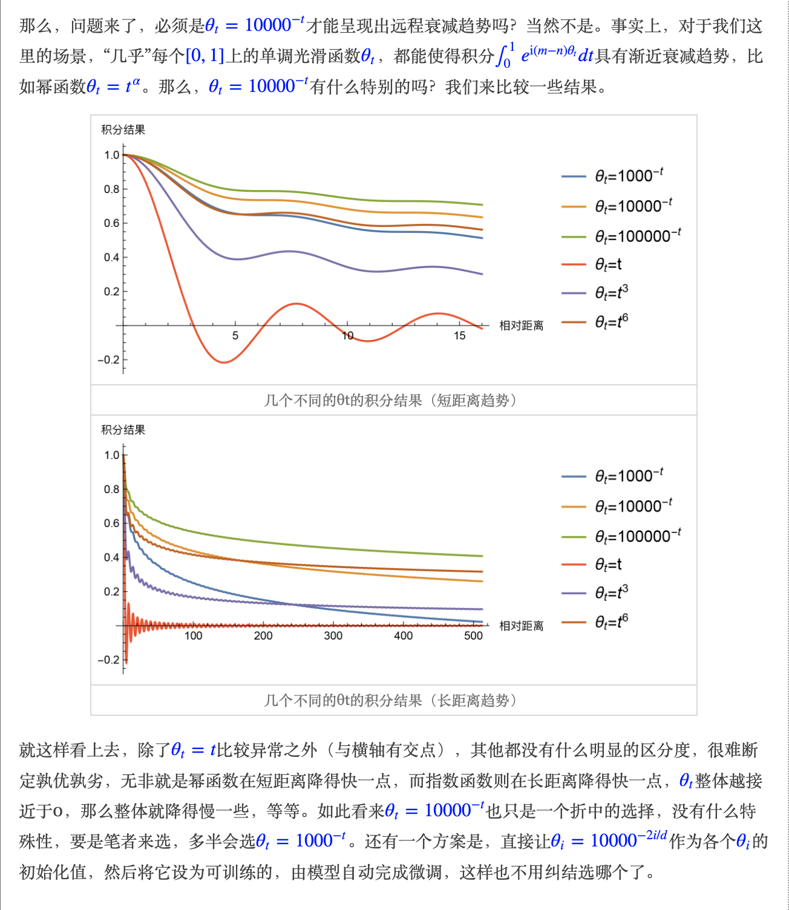

# FAQ

[Transformer 相关问题](https://zhuanlan.zhihu.com/p/554814230)
[位置编码](https://0809zheng.github.io/2022/07/01/posencode.html)
[positional_encoding](https://cloud.tencent.com/developer/article/2196111)
[The Annotated Transformer](https://nlp.seas.harvard.edu/2018/04/03/attention.html)

Query&Key&Value https://zh.d2l.ai/chapter_attention-mechanisms/attention-cues.html
查询（Query）： 指的是查询的范围，自主提示，即主观意识的特征向量,自主性提示被称为查询
键（Key）： 指的是被比对的项，非自主提示，即物体的突出特征信息向量，非自主性提示，
值（Value） ：  则是代表物体本身的特征向量，通常和Key成对出现

1. Transformer为何使用多头注意力机制？（为什么不使用一个头）
Multi-head attention allows the model to jointly attend to information from different representation subspaces at different positions. With a single attention head, averaging inhibits this.  [ref1](https://zhuanlan.zhihu.com/p/626820422)
多头注意力允许在不同位置不同表征子空间信息模型共同参与到模型
将隐状态向量分成多个头，形成多个子语义空间，可以让模型去关注不同维度语义空间的信息。有的头pattern由位置信息主导，有的头由语法信息主导，有的头由词法信息主导，而能够捕捉到语法/句法/词法信息的头其实是非常少的（这一点已被大量学术论文证明，笔者的句法破坏实验也验证了这一点），那么multi-head的作用就是为了保证这些pattern能够被抽取出来，需要让其有一定的头的基数，因为单头很容易就变成自己注意力全在自己身上了
- 通过观察大量样本的attention 矩阵我们发现，其实几乎每一个token在全句中的注意力都是稀疏的，即每个token只关注非常有限个其他token, 其余注意力基本可以看成是0, 大量稀疏就意味着我们可以对其进行低秩分解, 分为多头进行计算，计算量是差不多的，这样相当于模型融合，效果应该至少不差于单个注意力

2. Transformer为什么Q和K使用不同的权重矩阵生成，为何不能使用同一个值进行自身的点乘？ （注意和第一个问题的区别）
    假如直接用x和x做scale-dot就会得到一个对称矩阵，多样捕捉注意力的能力就会受限，i,j
 位置之间的前后向注意力就会变得一样，而我们一般期望两个token在一句话中先后顺序也能反映一定的不同信息。最重要的，这个对称矩阵的对角线上的值一定是本行最大的，（修正：这里并不一定是最大的，而是大概率是最大的，具体解释见评论区或者文章末尾的勘误[1]，感谢评论区老哥指出错误），这样softmax后对角线上的注意力一定本行最大，也就是不论任何位置任何搭配，每个token的注意力几乎全在自己身上，这样违背了Transformer用来捕捉上下文信息的初衷。所以乘上 w_q, w_k, w_v后有三个好处
 - 增加了参数量，增加模型的表达能力
 - 加入了不同的线性变换相当于对x做了不同的投影，将向量x投影到不同空间，增加模型的泛化能力，不要那么hard
 - 允许某个token对其他位置token的注意力大于对自己的注意力，才能更好的捕捉全局位置的注意力。
 
3. Transformer计算attention的时候为何选择点乘而不是加法？两者计算复杂度和效果上有什么区别？
   dot-product attention is much faster and more space-efficient in practice, since it can be implemented using highly optimized matrix multiplication code.

4. 为什么在进行softmax之前需要对attention进行scaled（为什么除以dk的平方根），并使用公式推导进行讲解
   q,k 的维度都是 d_k, 点乘之后
   
   - 为什么要进行scale？因为需要让softmax前的向量平缓一些，假设矩阵为[0.8, 0.1, 0.1], 直接softmax则输出为[0.50, 0.25, 0.25]，而scale后则为[0.43, 0.29, 0.29]，可以看到0处的概率相对于1、2处的位置，scale前后差距变小。一般情况下，不scale的attention一般都会接近一个one hot分布，这带来严重的梯度消失问题，导致训练效果差。
   - scale为什么非要除
    $ sqrt_d_k$ 
？Attention计算点积的过程中我们可以清晰地看到，由于每个Self-Attention的Q、K、V向量在输入前都被LayerNormalization归一化过，因此对每个Self-Attention的输入都有： ，其中每一行的均值都是0，方差都是1，那么点积后的矩阵每一行均值为0，方差为dk。因此需要除以标准差 以达到输出归一化的效果。
 - 不scale会怎么样？大量实验已经验证如果不scale，模型预训练很难收敛（这里的收敛指模型mlm任务的loss，即模型根据上下文预测出中心词的能力），除非像T5那样事先在初始化前就多除一个 
 ，同样可以让 初始方差变为1，模型也可以很好地收敛。
 To illustrate why the dot products get large, assume that the components of q and k are independent random
variables with mean 0 and variance 1. Then their dot product, q · k = 􏰉dk qiki, has mean 0 and variance dk.

5. 在计算attention score的时候如何对padding做mask操作？
6. 为什么在进行多头注意力的时候需要对每个head进行降维？（可以参考上面一个问题）
   
7. 大概讲一下Transformer的Encoder模块？
8. 为何在获取输入词向量之后需要对矩阵乘以embedding size的开方？意义是什么？
9. 简单介绍一下Transformer的位置编码？有什么意义和优缺点？
   为什么需要位置编码, 对于不带 attention mask 的纯self-attention 得到的矩阵是全对称的，这就是我们说Transformer无法识别位置的原因——全对称性
   - 位置编码，为什么使用10000,  [transformer位置编码代码](https://zhuanlan.zhihu.com/p/601844632)
   - [位置编码追根溯源](https://spaces.ac.cn/archives/8231)
   -  
   - 远程衰减， 式(1)的选择是θi=10000−2i/d,  这个形式有一个良好的性质，它使得随着|m−n|的增大，⟨pm,pn⟩有着趋于零的趋势。按照我们的直观想象，相对距离越大的输入，其相关性应该越弱，因此这个性质是符合我们的直觉的。只是，明明是周期性的三角函数，怎么会呈现出衰减趋势呢？  
   - 有读者会反驳：就算你把Sinusoidal位置编码说得无与伦比，也改变不了直接训练的位置编码比Sinusoidal位置编码效果要好的事实。的确，有实验表明，在像BERT这样的经过充分预训练的Transformer模型中，直接训练的位置编码效果是要比Sinusoidal位置编码好些，这个并不否认。本文要做的事情，只是从一些原理和假设出发，推导Sinusoidal位置编码为什么可以作为一个有效的位置，但并不是说它一定就是最好的位置编码。
 
10. 你还了解哪些关于位置编码的技术，各自的优缺点是什么？
11.简单讲一下Transformer中的残差结构以及意义。
12.为什么transformer块使用LayerNorm而不是BatchNorm？LayerNorm 在Transformer的位置是哪里？
13.简答讲一下BatchNorm技术，以及它的优缺点。
14.简单描述一下Transformer中的前馈神经网络？使用了什么激活函数？相关优缺点？
15.Encoder端和Decoder端是如何进行交互的？（在这里可以问一下关于seq2seq的attention知识）
16.Decoder阶段的多头自注意力和encoder的多头自注意力有什么区别？（为什么需要decoder自注意力需要进行 sequence mask)

1. Transformer的并行化提现在哪个地方？Decoder端可以做并行化吗？
     
18.简单描述一下word piece model 和 byte pair encoding，有实际应用过吗？
1.  Transformer训练的时候学习率是如何设定的？Dropout是如何设定的，位置在哪里？Dropout 在测试的需要有什么需要注意的吗？
2.  引申一个关于bert问题，bert的mask为何不学习transformer在attention处进行屏蔽score的技巧？
19. 为什么要自己和自己做attention?意图是什么？
    主要就是为了上下文交互，我们知道不论多高大上的双向语言模型，其实就是在建模一个经典的概率：
    翻译成人话就是已知一个词的上下文语境，预测这个词出现在这个位置的概率，核心思想就是用这个词的上下文表征这个词本身。建模的训练任务就是已知上下文的情况下猜测该中心词是哪个，啊就是完形填空。那要完成这样一个任务就必须让上下文按照顺序产生信息交互，先回顾下BERT之前的语言模型是怎么实现上下文交互的：
    那BERT如何完成上下文信息交互呢？依靠Self-Attention。由公式 
 可知，输出embedding 
 中的每一行都代表一个token的embedding，它们都是由原始embedding 
 中的所有向量加权得到输出的embedding，每个token都融汇了其他token的加权信息，实现了上下文信息的交互。

  