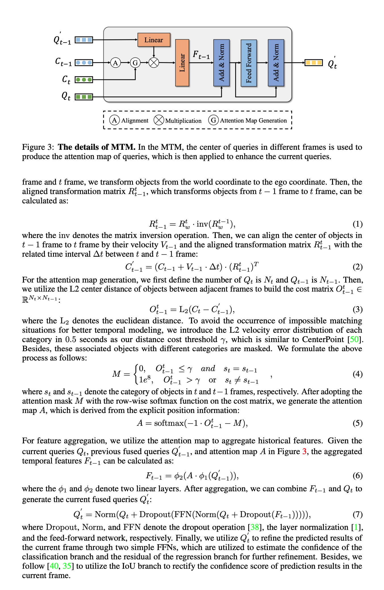

# [Query-based Temporal](https://openreview.net/pdf?id=gySmwdmVDF)

_February_2024_

tl;dr:  The motion information of 3d objectes, such as velocity and pose  is modeled into temporal fusion module.


 

 ## MTM code 
 ```
 

 ```


#### Notes
    - MTM模块是一个轻量级的时序融合模块，可以把这个模块用来进行其他时许融合的任务