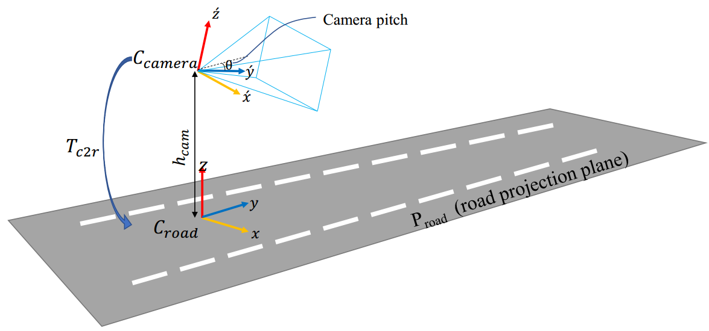

[IPM](https://github.com/baidut/ITS/issues/53)

将相机视角转换成鸟瞰图。其实质是求相机平面与地面的homography矩阵

[Apply IPM in Lane detection from bev](https://leijiezhang001.github.io/lane-det-from-BEV/)
[逆透视变换ipm多种方式及代码总结](https://hermit.blog.csdn.net/article/details/120900854)

